便捷记账
===============

介绍
-----------------------------------
基于安卓基础知识点开发的个人记账工具，其中包括记录当天收支情况，计算当天以及当月共收支总钱数，能查看历史账单，能对于每月收支情况进行图标分析，百分比分析，能够搜索用户关于某种记录的全部收支情况等功能。基本上能够解决个人记账的所有问题，界面简约美观，滑动流畅。

功能模块
-----------------------------------
```
┌─隐私设置（小眼睛）
├─查看图表分析
│  └─查看历史纪录
├─搜索信息
├─记一笔
│  ├─支出
│  └─收入
└─更多
   ├─关于
   ├─设置
   ├─账单记录
   │  └─历史记录
   └─账单详情
```

系统效果
----
##### 首页

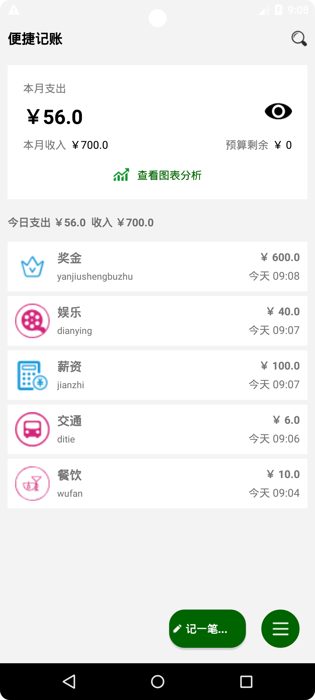

##### 隐私设置

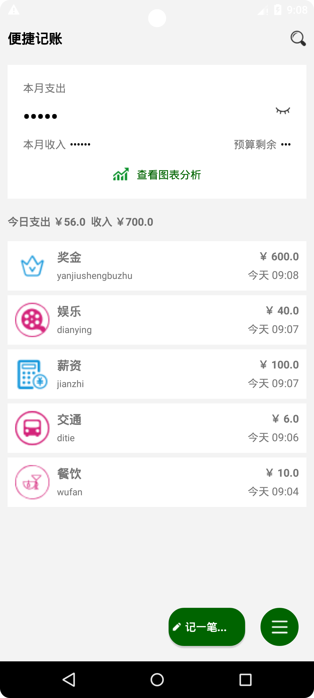

##### 图表分析（支出）

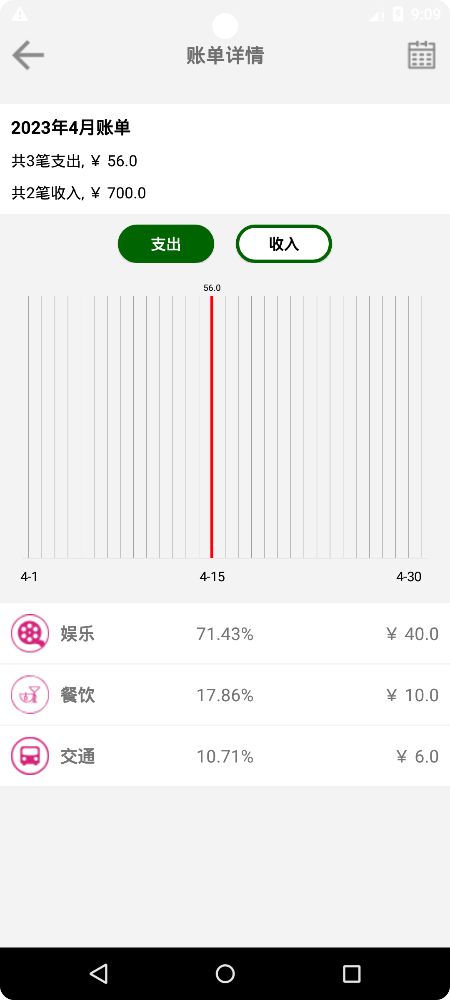

##### 图表分析（收入）

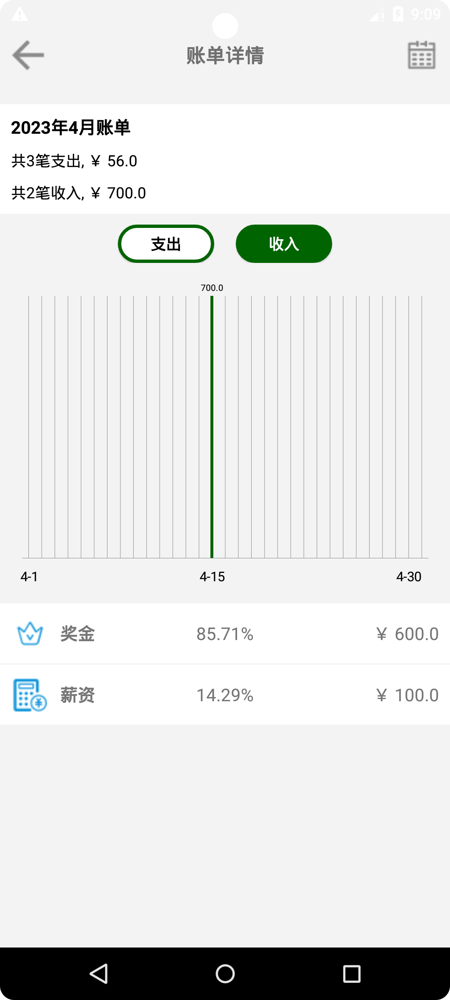

##### 历史记录

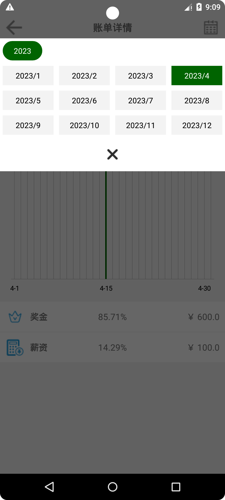

##### 搜索信息

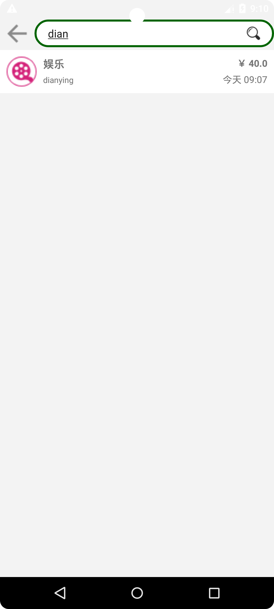

##### 记一笔（支出）

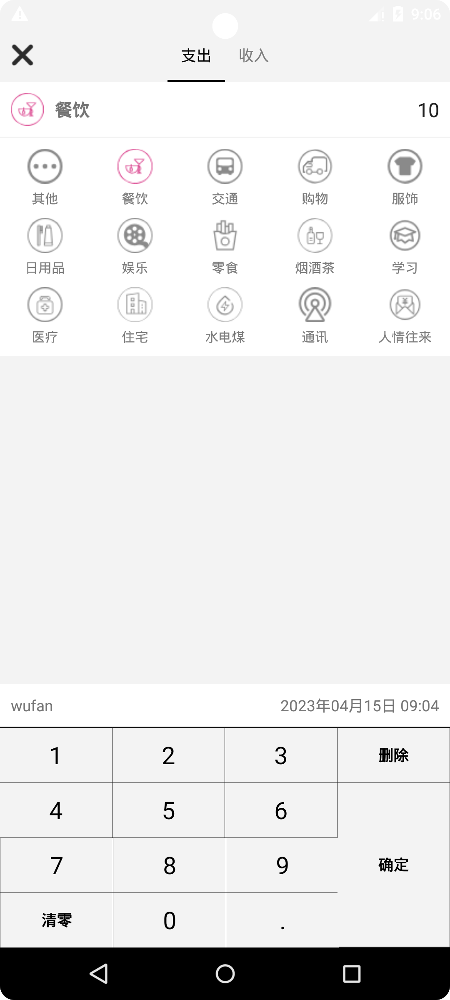

##### 记一笔（收入）

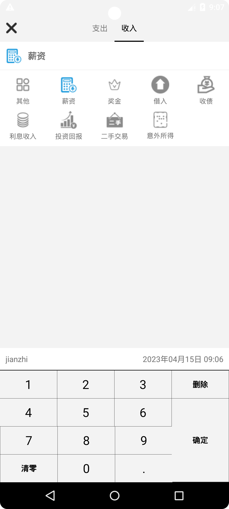

##### 关于

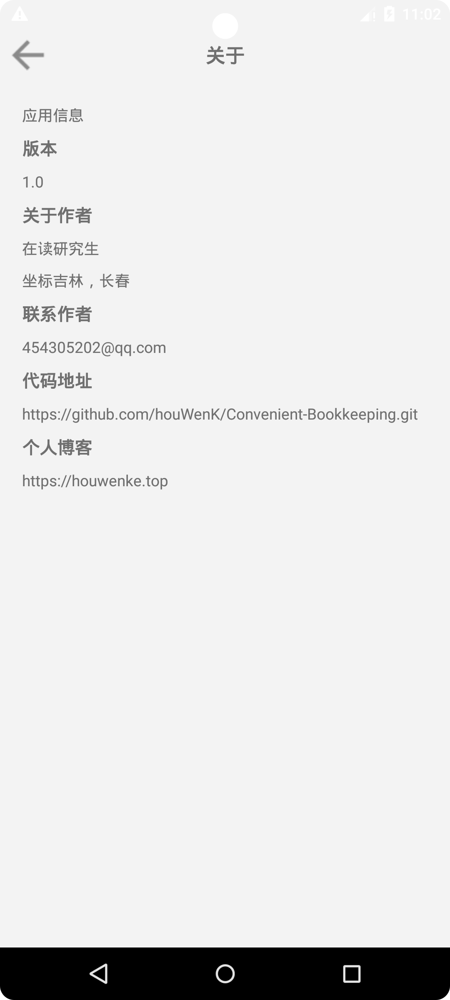

##### 设置

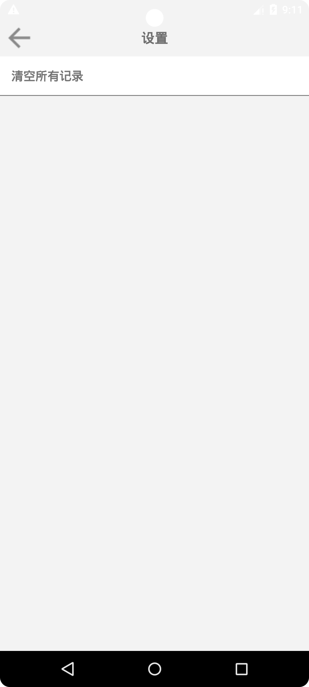

##### 账单记录

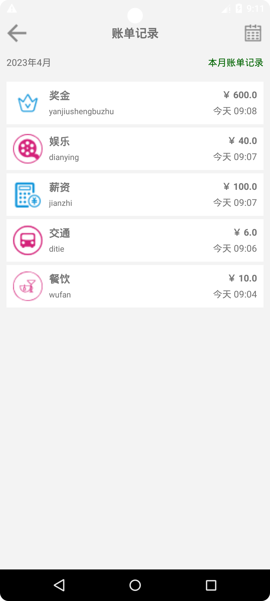

技术架构
-----------------------------------
#### 开发环境
- Android Gradle Plugin Version 3.5.2
- Gradle Version 5.4.1
- Compile Sdk Version 29
- Build Tools Version 19.0.3

#### 项目重要技术点

- 绘制布局，android基本view控件的属性和使用

- Activity页面展示，跳转和传值
- 使用碎片加载界面，滑动视图切换页面
- 自定义对话框
- 自定义软键盘绘制和使用列表视图以及网格视图的适配器使用和页面加载
- 使用Android自带数据库，创建表，并进行增删改查
- 定义drawable文件，设定布局以及控件样式
- 使用MPAndroidChart第三方框架绘制柱状图

项目下载
----
```bash
git clone https://github.com/houWenK/Convenient-Bookkeeping.git
```
关于作者
----
研究生在读

热爱编程，欢迎大家一起交流学习

邮箱：454305202@qq.com 